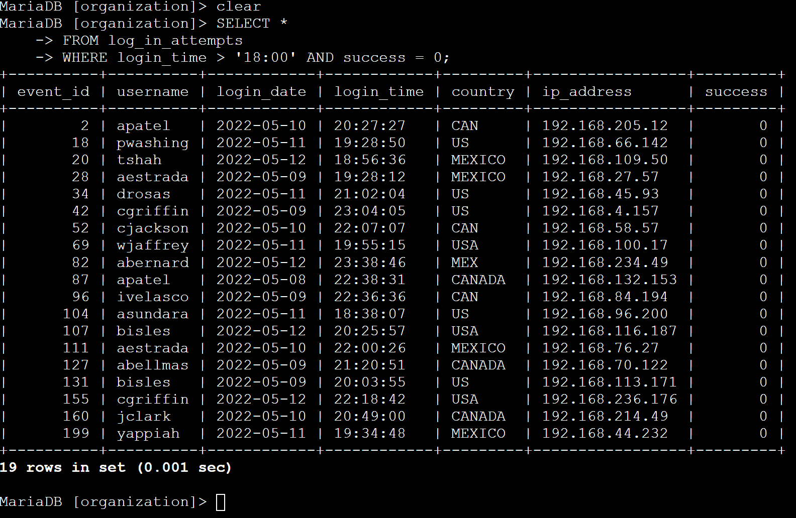
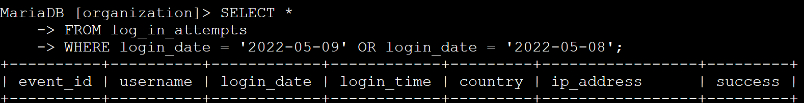
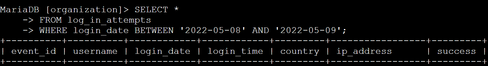
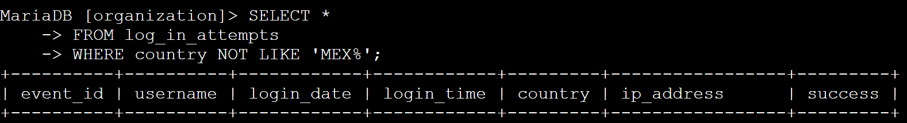
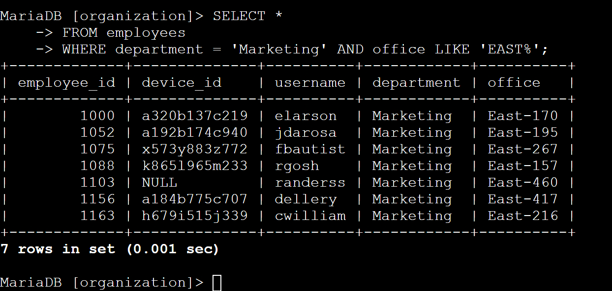
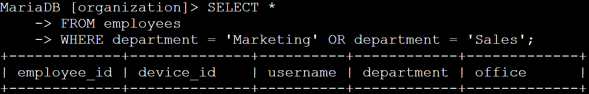
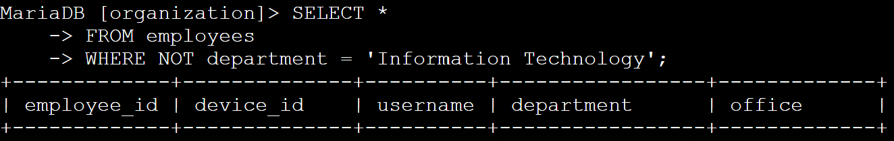

# SQL Queries and Filters

## Project description

Using SQL queries and filters, sort through the database entries to investigate potential security issues that involve login attempts and employee machines. 

## Retrieve after hours failed login attempts

Using SELECT *, we select all columns in the table. We use FROM to access the table “log_in_attempts.” In order to filter out all login attempts before close, at 6:00pm, and all successful attempts we use WHERE > ‘18:00’ AND success = 0.  When filtering for time, it’s important to use the 24 hour format in ‘hh:mm.ss’ The “ss” can be left off when not necessary. 

## Retrieve login attempts on specific dates

In this section we’re looking to filter for all logins on May 9th, 2022 and May 8th, 2022. Like above, we use SELECT * and FROM log_in_attempts to grab all columns from the log_in_attempts table. We use WHERE login_date = ‘2022-05-09’ OR login_date = ‘2022-05-08’ to filter out all activity not on May 8th and 9th 2022. This could also be done using WHERE login_date BETWEEN ‘2022-05-08’ AND ‘2022-05-08’. It’s important to remember that the date format is always YYYY-MM-DD (as opposed to the MM-DD-YYYY that is often used. 

## Retrieve login attempts outside of Mexico

In this scenario we want to exclude all login attempts that are in Mexico. In order to do this we use WHERE country NOT LIKE ‘MEX%’. Because the table contains both “MEX” and “MEXICO” in the country column, we need to exclude both strings from the returned results. The LIKE is necessary for using string comparisons that are not exact. The long way to do this would be to use NOT ‘MEX’ OR NOT ‘MEXICO’.  However, we can use LIKE and ‘MEX%’ to exclude all data entries where the data in the country column starts with MEX. 

## Retrieve employees in Marketing

Here we are locating machines that need updating. In this case, we need all the machines that are used by the marketing department and are located in the EAST building. 

We start with SELECT * FROM employees to select all columns in the employees table. To filter for the marketing department in the East building, we use WHERE department = ‘Marketing’ AND office LIKE ‘EAST%’. This ensure that only the marketing department employee devices are returned. As well, bc the office column lists the individual offices in the office column as [building location]-[office number] we use “LIKE ‘EAST%’ to return all offices that are located in the East building. 

## Retrieve employees in Finance or Sales

This section is similar to the last one, where we are looking to locate all employees in the Finance and Sales departments. We are not filtering for anything else. 

We select all columns from the employees table. We filter for only the marketing and sales departments by using WHERE department = ‘Marketing’ OR department = ‘Sales’. 

## Retrieve all employees not in IT

Lastly, we need a list of all employees that are not in the IT department. Just like filtering before, we select all columns from the employees table. To exclude only the results where the department is IT we use WHERE NOT department = ‘Information Technology’. This returns all our results where the department is something other than ‘Information Technology.’ 

## Summary

Using filters is important for displaying only the data that we need. Because tables can be extremely large, it’s important to filter out unnecessary data to make the data easier to read and understand. 

It’s important to note that none of these examples require the filtering of columns. If we wanted to only show certain table columns we would use SELECT [individual column names]. For example, we could use SELECT employee_id, username, department FROM employees to display only the employee ID, username, and department columns of the employees table.